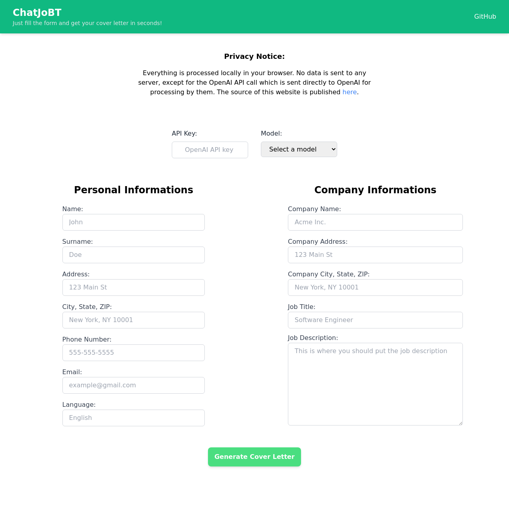

# ChatJoBT

This is a simple webapp written for learning purposes using ReactJS, It gathers some data and processes it via OpenAI APIs. ~Note that you can achieve the same exact result by simply putting the data directly into the ChatGPT textbox and pressing the enter key on your keyboard.~

## Description
Just read this pitch ChatGPT itself wrote:

> Are you tired of spending hours crafting the perfect cover letter for each job application? Do you wish there was a faster and more efficient way to apply for multiple jobs without sacrificing quality? Look no further—ChatJobT is here to revolutionize your job application process!

> ChatJobT is a cutting-edge website that harnesses the power of ChatGPT, an advanced language model, to generate customized cover letters in a matter of minutes. With our platform, you can bid farewell to the time-consuming task of writing cover letters from scratch, and instead, effortlessly generate professional and personalized letters tailored to each job you're applying for.

## Usage

Go [here](https://chatjobt.site/), or paste the following in the terminal:

``` bash
$ git clone https://github.com/francesco-plt/chatjobt.git
$ cd chatjobt
$ npm i
$ npm start
```

</img>
